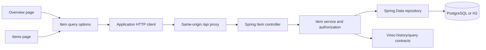

# Flagship architecture proof

The flagship uses normal application boundaries. The dashboard does not bypass the public Item feature surface, and the Item feature does not reach into Starter internals.

## Boundary map

| Boundary | Application owns | Vireo supplies |
| --- | --- | --- |
| Presentation | page composition, operational language, low-stock threshold, navigation | layout, loading-region, skeleton, responsive-table, overlay, and form primitives |
| Client data | Item query keys/options, filters, cache invalidation policy | typed pagination and TanStack Query integration helpers |
| HTTP | app client configuration, endpoint adapter, session recovery behavior | wire models and reusable infrastructure contracts |
| Backend | Item controller/service/repository, roles, seed, migrations | authentication, history, query, and common Spring modules |
| Operations | containers, profiles, secrets, reset cadence, monitoring owner | documented integration seams; no hosted control plane |

## Trace one overview request

1. `AppPageHome` requests the first 100 Items through `ItemQuery.search`.
2. The online Item API adapter sends the application-owned filter and pagination contract to `/api/items`.
3. Spring authorization and the Item service execute the query against the configured database.
4. The response is parsed into the Zod Item model.
5. `buildHomeOverviewSnapshot` performs a pure application-owned projection; its unit test fixes the counting and low-stock behavior.
6. `AppPageHomeView` renders the same structure for loaded and initial-loading states. Storybook checks its geometry, accessibility, locale, color scheme, and responsive modes.

The production-like deployment test independently proves the frontend image, same-origin API proxy, security headers, backend readiness, and PostgreSQL connection. These checks prove the included path; they do not prove a future application's domain policy.

