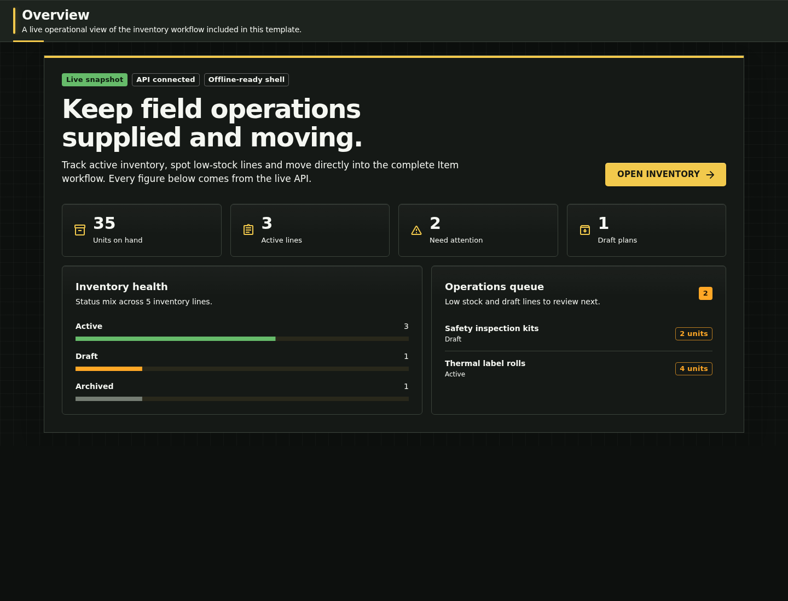

# Flagship experience

The flagship is a focused field-inventory workspace for a small operations team. An operations coordinator needs to see whether active sites are supplied, identify low-stock or unapproved lines, and then manage the underlying records without changing tools.

This is one production-shaped Item vertical slice, not a claim that Vireo contains a finished inventory product. The slice is deliberately deep enough to prove the framework integration while remaining small enough to replace.

## Primary evaluation path

1. Sign in and land on a live API-backed inventory snapshot.
2. Read total units, active lines, low-stock attention, and draft plans.
3. Follow the operations queue into the responsive inventory workspace.
4. Search and filter Items; an administrator can also create, edit, inspect history, and delete them.
5. Change the app-owned Item behavior or generate another capability, then rerun verification.

The development profile seeds active, draft, archived, low-stock, and healthy records. The public demo profile seeds the same inventory but only the non-administrative `demo` account, making the hosted evaluation journey read-only.

## Proof hierarchy

| What is visible                           | Implementation evidence                                                                  | Executable evidence                                                              |
| ----------------------------------------- | ---------------------------------------------------------------------------------------- | -------------------------------------------------------------------------------- |
| Live overview metrics and attention queue | `frontend/src/pages/home/AppPageHome.tsx`, `AppPageHomeView.tsx`, and `home-overview.ts` | Unit projection tests plus loaded/loading/empty/error Storybook stories          |
| Responsive searchable Item workflow       | `frontend/src/pages/items/AppPageItems.tsx` and `frontend/src/features/item`             | Item model/query tests, Storybook state matrix, and Playwright lifecycle journey |
| Real persisted API                        | `src/main/java/com/vireocode/startertemplate/app/item` and Flyway migrations             | Spring integration tests and production-like Compose smoke                       |
| Public sandbox operations                 | `compose.demo.yaml`, `DemoBootstrapConfig`, and `contracts/flagship-demo-policy.json`    | Reset policy gate and scheduled hosted synthetic journey                         |
| Replaceable application code              | ordinary `pages`, `features`, controller/service/repository, and migration sources       | generator ownership checks and the 30-minute vertical-slice tutorial             |

See [flagship architecture proof](flagship-architecture.md) for the request path and [evaluation guide](tutorials/evaluate-flagship.md) for a copy-pastable walkthrough.

Record a sanitized result through the framework's [public-beta evaluation form](https://github.com/vireocodedev/vireo/issues/new?template=public_beta_feedback.yml). If you control a non-fixture application and meet the qualification statements, use the [independent adopter check-in](https://github.com/vireocodedev/vireo/issues/new?template=adopter_check_in.yml). The form definitions and submitted issues are public; opening or submitting the rendered forms requires GitHub sign-in. Open-ended questions belong in [Discussions](https://github.com/vireocodedev/vireo/discussions); suspected vulnerabilities do not.

## Honest boundary

- The overview summarizes at most the first 100 Item lines and is a reference projection, not an analytics engine.
- Offline support is an installable/read shell and explicit mutation policy; arbitrary offline conflict resolution is not supplied.
- The public demo is disposable synthetic data operated on a best-effort basis with no uptime SLA; its versioned operations policy records the deployed revision and evidence.
- A polished maintainer-built demo is not independent-adopter, demand, production-readiness, or time-saved evidence.
- Authentication, authorization, data classification, domain rules, and deployment ownership remain application responsibilities.
